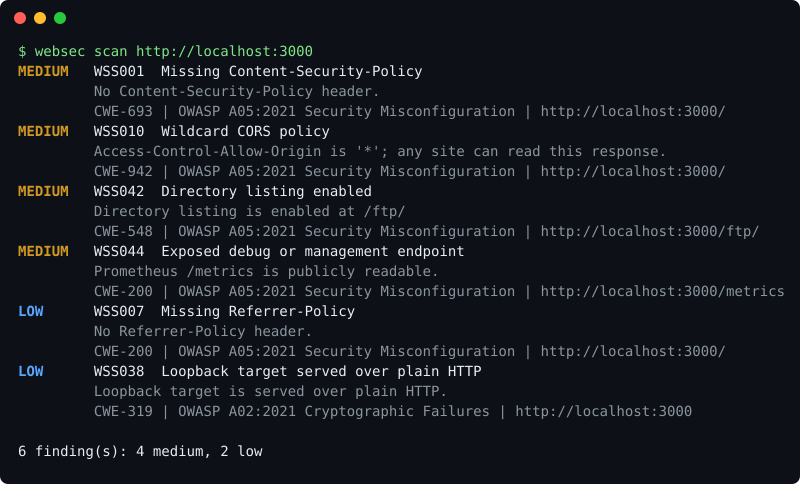

# websec-scanner

[](https://github.com/Octavian-Mihai/web-security-scanner/actions/workflows/ci.yml)
[](https://github.com/Octavian-Mihai/web-security-scanner/actions/workflows/security.yml)
[](LICENSE)


A passive web security scanner built for CI. It checks security headers, cookies, TLS, CORS,
page content and a few commonly exposed paths; maps every finding to a **CWE** and an
**OWASP Top 10 (2021)** category; writes **SARIF 2.1.0** so results appear in GitHub's
**Security tab**; and ships as a **GitHub Action** that fails the build above a severity
threshold.



*Real output from scanning OWASP Juice Shop (`scripts/render_demo_svg.py` renders it; nothing is mocked).*

## Use it as a GitHub Action

```yaml
permissions:
  contents: read
  security-events: write   # upload SARIF to the Security tab
  pull-requests: write     # only if you enable pr-comment

steps:
  - uses: actions/checkout@v5
  - uses: Octavian-Mihai/web-security-scanner@v1
    with:
      url: https://staging.example.com
      fail-on: high            # critical | high | medium | low | info | none
      config: .websec.toml     # accepted risks, each with a reason (optional)
      crawl-depth: 1           # also scan pages linked from the start URL (optional)
      pr-comment: true         # post/update a summary comment on PRs (optional)
```

The SARIF upload runs under `always()`, so findings reach the Security tab even when the gate
fails the build. Outputs: `findings`, `suppressed`, `highest-severity`, `sarif-file`. A markdown
table is added to the run summary. All inputs are documented in [`action.yml`](action.yml).

## Use it as a CLI

```bash
pip install git+https://github.com/Octavian-Mihai/web-security-scanner
websec scan https://example.com --sarif out.sarif --fail-on medium
websec scan https://example.com --crawl-depth 2 --delay 0.2 --html report.html
websec rules          # every rule with severity, CWE, OWASP
```

| Exit code | Meaning |
|---|---|
| 0 | Scan completed; nothing at or above `--fail-on` |
| 1 | Findings at or above `--fail-on` (the CI gate) |
| 2 | Scan error (unreachable, out of scope, bad arguments). Deliberately **not** 0, so an outage can't pass a build as "clean" |

## Checks (33 rules)

| Group | Rules | What it does |
|---|---|---|
| `headers` | WSS001-009 | CSP (missing/weak), HSTS (missing/short), clickjacking, nosniff, Referrer-Policy, Permissions-Policy, version disclosure |
| `cookies` | WSS020-023 | Secure / HttpOnly / SameSite and `__Host-`/`__Secure-` prefix misuse, across every redirect hop |
| `content` | WSS050-053 | Third-party scripts/styles without SRI, mixed content, JWTs in URLs |
| `cors` | WSS010-011 | Wildcard origin; reflected origin + credentials |
| `tls` | WSS030-038 | Plain HTTP (loopback is low), no HTTP-to-HTTPS redirect, TLS 1.0/1.1, expired / soon-to-expire / untrusted certificate, weak key, SHA-1/MD5 signature |
| `exposure` | WSS040-044, 052 | `/.git/HEAD`, `/.env`, directory listings, Actuator/`server-status`/Prometheus/`phpinfo`, source maps, missing `security.txt`. **Light probing**: a few dozen GETs; drop it with `--checks headers,cookies,content,cors,tls` |

Severity is fixed per rule in [`rules.py`](src/websec/rules.py), the single source of truth for
the CWE/OWASP mapping, SARIF rule metadata and every report.

## Accepting risk without turning the gate off

```toml
# .websec.toml (auto-discovered, or --config)
[[ignore]]
rule    = "WSS008"
reason  = "Permissions-Policy tracked in SEC-123"   # required
url     = "https://staging.example.com/*"           # optional glob
expires = 2027-03-01                                # optional; after this it stops applying
```

Suppressed findings are removed from the gate and from SARIF (so GitHub closes the alert) but
stay visible, with their reasons, in the console, markdown and JSON output. Expired and
never-matching entries are reported. See [`.websec.toml.example`](.websec.toml.example).

## Scope, politeness and safety

- Only the hosts of the URLs you pass (plus `--allow-host`) can be contacted. Redirects are
  followed manually and an off-scope hop **aborts before it is requested**.
- `--delay` is a global minimum gap between requests; crawling is same-origin, asset-skipping
  and honours `robots.txt` (`--no-robots` to override).
- Only scan systems you own or are authorised to test. See [SECURITY.md](SECURITY.md).

## Testing against OWASP Juice Shop

```bash
docker compose up -d juice-shop
websec scan http://localhost:3000 --sarif results/juice.sarif
python scripts/assert_findings.py results/juice.sarif WSS038 WSS001 WSS010 WSS042 WSS044 --forbid WSS006 WSS005
```

The assert script also validates the SARIF against the official 2.1.0 schema. CI runs the
Action itself against a Juice Shop service container four ways: gate at `high` (must pass, SARIF
uploaded), gate at `medium` (must **fail** the build), with a baseline file (must suppress exactly
the accepted findings), and an off-scope redirect (must exit 2). A separate
[consumer-test workflow](.github/workflows/consumer-test.yml) runs the published `@v1` Action with no
checkout, exactly as an outside repository would.

## Quality gates

`ruff`, `mypy --strict`, `pytest` with a 90% coverage gate (property-based parser tests, one
vulnerable fixture **and** clean twin per rule, a false-positive corpus, real TLS servers with
deliberately broken certificates), CodeQL, bandit, pip-audit, a package build check and
SHA-pinned actions kept current by Dependabot. The false-positive corpus
([`tests/corpus`](tests/corpus/README.md)) is hand-written to model well-configured sites; it is not recorded traffic.

## How it compares

| | websec-scanner | OWASP ZAP | Nuclei | Mozilla Observatory |
|---|---|---|---|---|
| Approach | Passive, fixed rule set | Proxy + spider + active attacks, auth, scripting | Large community template engine | Hosted grader for public sites |
| Strength | Fast CI guardrail, native SARIF + CWE/OWASP, baseline with expiry | Finds injection and logic flaws | Breadth, community coverage | Zero setup |
| Limits | No injection/auth/logic flaws, shallow crawl | Heavier to run and tune | Needs template curation for low noise | Can't reach localhost/private staging or CI service containers |

Use this alongside a DAST tool, not instead of one.

## Limitations

- Passive and shallow: no authentication, no payload injection; it complements a DAST tool.
- Legacy-TLS detection pins a handshake to TLS 1.0/1.1; if the local OpenSSL can't speak them
  the result is "inconclusive" (no finding), never a false alarm.
- TLS analysis covers the leaf certificate only (no chain/OCSP analysis, no cipher enumeration).
- Plain-HTTP detection on a URL with an explicit port assumes no HTTPS counterpart exists.
- `pr-comment` posts a summary; "new vs. base" requires supplying an earlier SARIF via
  `compare-with`.

More in [docs/design.md](docs/design.md) (decisions and trade-offs), [CONTRIBUTING.md](CONTRIBUTING.md)
and the [CHANGELOG](CHANGELOG.md). Licensed under [MIT](LICENSE).
