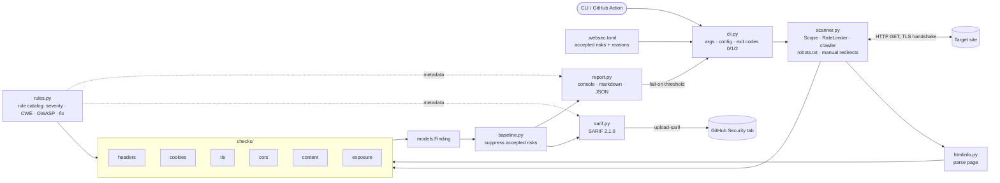

# Architecture

A passive scanner: it reads what a server volunteers, maps findings to rules (CWE / OWASP), and emits console, JSON, markdown or SARIF output. It ships as a CLI and a GitHub Action.

